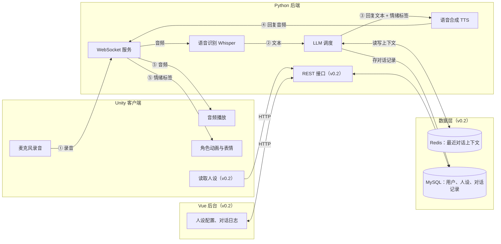

# Nagi 架构图

## 整体架构

```mermaid
flowchart LR
    subgraph Client["Unity 客户端"]
        MIC["麦克风录音"]
        PLAY["音频播放"]
        AVATAR["角色动画与表情"]
        PERSONA["读取人设（v0.2）"]
    end

    subgraph Backend["Python 后端"]
        WS["WebSocket 服务"]
        ASR["语音识别 Whisper"]
        LLM["LLM 调度"]
        TTS["语音合成 TTS"]
        API["REST 接口（v0.2）"]
    end

    subgraph Data["数据层（v0.2）"]
        REDIS[("Redis：最近对话上下文")]
        MYSQL[("MySQL：用户、人设、对话记录")]
    end

    subgraph Admin["Vue 后台（v0.2）"]
        UI["人设配置、对话日志"]
    end

    MIC -->|"① 录音"| WS
    WS -->|"音频"| ASR
    ASR -->|"② 文本"| LLM
    LLM -->|"③ 回复文本 + 情绪标签"| TTS
    TTS -->|"④ 回复音频"| WS
    WS -->|"⑤ 音频"| PLAY
    WS -->|"⑤ 情绪标签"| AVATAR

    LLM <-->|"读写上下文"| REDIS
    LLM -->|"存对话记录"| MYSQL
    PERSONA -->|"HTTP"| API
    UI <-->|"HTTP"| API
    API <--> MYSQL
```